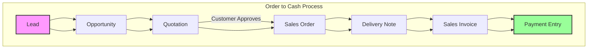
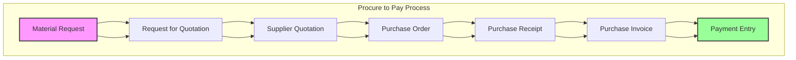
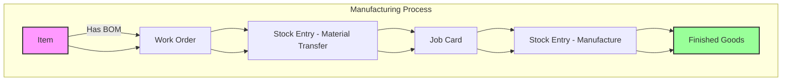
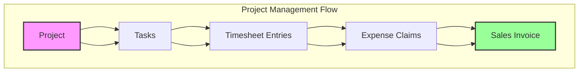
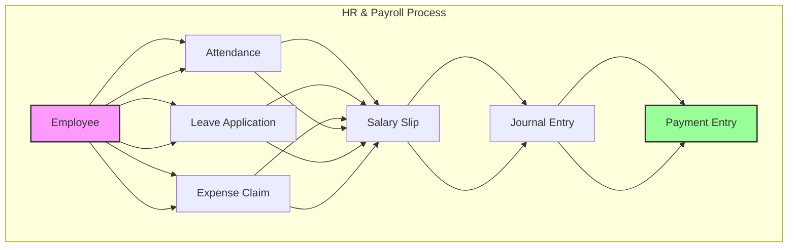
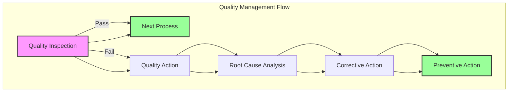
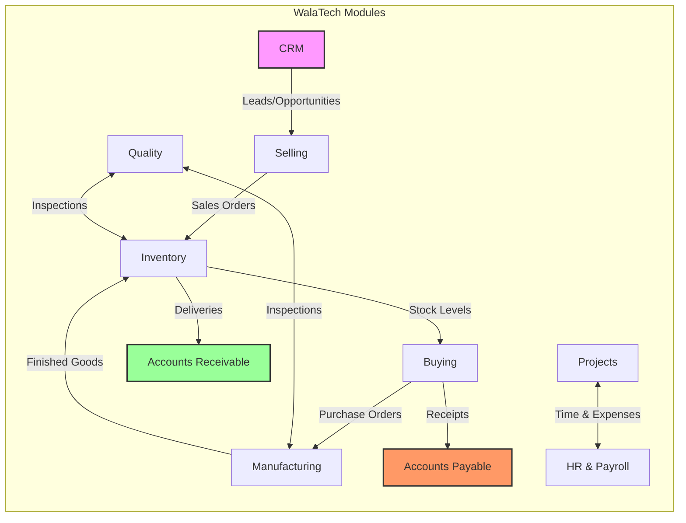

# WalaTech - Data Flow Diagrams

This document contains visual representations of key data flows in the WalaTech system. These diagrams use Mermaid.js syntax and can be rendered in any Markdown viewer that supports Mermaid.

## 1. Order to Cash Process

## 2. Procure to Pay Process

## 3. Manufacturing Process

## 4. Project Management Flow

## 5. HR & Payroll Process

## 6. Quality Management Flow

## 7. Integrated Business Flow

## Usage Notes

1. These diagrams use Mermaid.js syntax
2. To view them, use a Markdown viewer that supports Mermaid
3. In VS Code, install the "Mermaid Preview" or similar extension
4. On GitHub/GitLab, the diagrams will render automatically
5. You can copy the Mermaid code to online editors like [Mermaid Live Editor](https://mermaid.live/)

## Customization

You can modify these diagrams by:
1. Changing the node text
2. Adjusting the flow direction (TD for top-down, LR for left-right)
3. Adding or removing nodes and connections
4. Customizing styles with the `style` blocks
