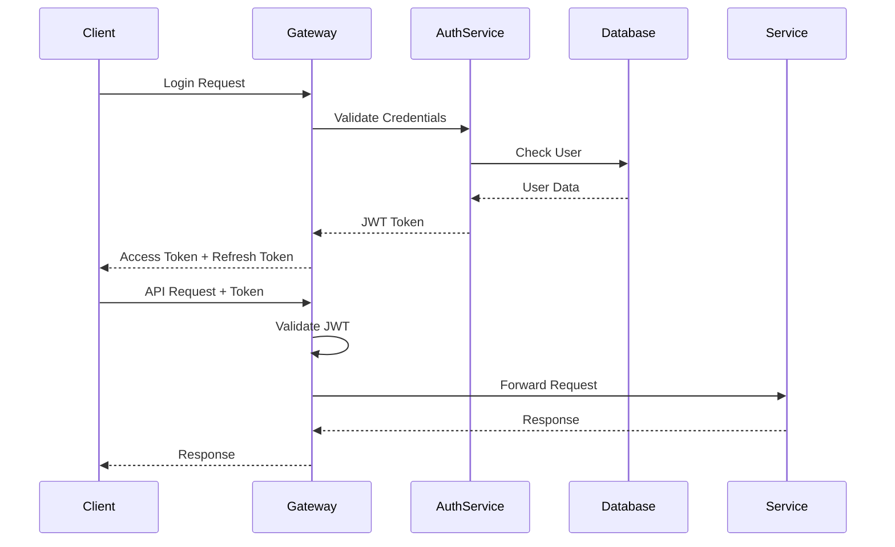

# Walatech PMS Technical Architecture

## Architecture Overview

The Walatech Production Management System follows a microservices architecture pattern with clear separation of concerns, enabling scalability, maintainability, and independent deployment of services.

## System Architecture Diagram

```
┌─────────────────────────────────────────────────────────────────┐
│                        Client Layer                             │
├─────────────────────────────────────────────────────────────────┤
│  Web App (Next.js)  │  Mobile App (Future)  │  API Clients    │
└─────────────────────────────────────────────────────────────────┘
                                │
                                ▼
┌─────────────────────────────────────────────────────────────────┐
│                      API Gateway (NestJS)                      │
├─────────────────────────────────────────────────────────────────┤
│  • Authentication Middleware    • Rate Limiting                │
│  • Request Routing             • Response Transformation       │
│  • Load Balancing              • API Versioning               │
└─────────────────────────────────────────────────────────────────┘
                                │
                                ▼
┌─────────────────────────────────────────────────────────────────┐
│                     Microservices Layer                        │
├─────────────┬─────────────┬─────────────┬─────────────┬─────────┤
│ Auth        │ Core Data   │ Production  │ Stock       │ Quality │
│ Service     │ Service     │ Service     │ Service     │ Service │
├─────────────┼─────────────┼─────────────┼─────────────┼─────────┤
│ Shipment    │ Accounting  │ HR          │ Notification│ Report  │
│ Service     │ Service     │ Service     │ Service     │ Service │
└─────────────┴─────────────┴─────────────┴─────────────┴─────────┘
                                │
                                ▼
┌─────────────────────────────────────────────────────────────────┐
│                     Message Broker Layer                       │
├─────────────────────────────────────────────────────────────────┤
│              RabbitMQ / Redis Pub/Sub                          │
└─────────────────────────────────────────────────────────────────┘
                                │
                                ▼
┌─────────────────────────────────────────────────────────────────┐
│                      Data Layer                                │
├─────────────────────────────────────────────────────────────────┤
│  MariaDB (Primary)  │  Redis (Cache)  │  File Storage (S3)    │
└─────────────────────────────────────────────────────────────────┘
```

## Core Services Architecture

### 1. Authentication Service

**Responsibilities:**
- User authentication and authorization
- JWT token management
- Role-based access control (RBAC)
- Tenant management
- Password policies and security

**Technology Stack:**
- NestJS with TypeScript
- MariaDB for user data
- Redis for session management
- bcrypt for password hashing
- JWT for token management

**API Endpoints:**
```typescript
// Authentication endpoints
POST /auth/login
POST /auth/logout
POST /auth/refresh
POST /auth/forgot-password
POST /auth/reset-password

// User management
GET /users
POST /users
GET /users/:id
PUT /users/:id
DELETE /users/:id

// Role management
GET /roles
POST /roles
POST /users/:id/roles
DELETE /users/:id/roles/:roleId

// Tenant management
GET /tenants
POST /tenants
GET /tenants/:id
PUT /tenants/:id
```

### 2. Core Data Service

**Responsibilities:**
- Product catalog management
- Bill of Materials (BOM) management
- Work center configuration
- Master data validation
- Data import/export

**Key Entities:**
```typescript
interface Product {
  id: string;
  tenant_id: string;
  code: string;
  name: string;
  description?: string;
  category: string;
  uom: string;
  isActive: boolean;
  translations: ProductTranslation[];
  createdAt: Date;
  updatedAt: Date;
}

interface BOM {
  id: string;
  tenant_id: string;
  productId: string;
  version: string;
  isActive: boolean;
  items: BOMItem[];
  operations: BOMOperation[];
}

interface WorkCenter {
  id: string;
  tenant_id: string;
  code: string;
  name: string;
  capacity: number;
  costPerHour: number;
  isActive: boolean;
}
```

### 3. Production Service

**Responsibilities:**
- Work order management
- Production planning
- Capacity planning
- Production execution tracking
- Manufacturing analytics

**Key Workflows:**
```typescript
// Production Planning Flow
1. Create Production Plan
2. Generate Work Orders
3. Schedule Operations
4. Allocate Resources
5. Release to Production

// Production Execution Flow
1. Start Work Order
2. Track Material Consumption
3. Record Labor Hours
4. Update Progress
5. Complete Work Order
```

### 4. Stock Management Service

**Responsibilities:**
- Warehouse management
- Inventory tracking
- Stock movements
- Reorder point management
- Stock valuation

**Key Features:**
- Multi-warehouse support
- Real-time stock levels
- Automated reorder alerts
- FIFO/LIFO costing methods
- Batch/serial number tracking

### 5. Quality Control Service

**Responsibilities:**
- QC checkpoint management
- Inspection planning
- Non-conformance reporting
- Quality metrics tracking
- Corrective action management

## Frontend Architecture

### Technology Stack
- **Framework:** Next.js 14+ with App Router
- **Language:** TypeScript
- **UI Library:** Material-UI (MUI) v5+
- **State Management:** Zustand
- **Data Fetching:** TanStack Query (React Query)
- **Internationalization:** react-i18next
- **Styling:** Emotion (CSS-in-JS)
- **Testing:** Jest + React Testing Library

### Project Structure
```
frontend/
├── src/
│   ├── app/                    # Next.js App Router pages
│   │   ├── (auth)/            # Authentication routes
│   │   ├── (dashboard)/       # Main application routes
│   │   ├── globals.css
│   │   ├── layout.tsx
│   │   └── page.tsx
│   ├── components/
│   │   ├── common/            # Reusable components
│   │   │   ├── Button/
│   │   │   ├── DataTable/
│   │   │   ├── Form/
│   │   │   └── Layout/
│   │   ├── forms/             # Form components
│   │   └── modules/           # Module-specific components
│   │       ├── production/
│   │       ├── inventory/
│   │       └── quality/
│   ├── hooks/                 # Custom React hooks
│   │   ├── useAuth.ts
│   │   ├── usePermissions.ts
│   │   └── useTenant.ts
│   ├── services/              # API service layer
│   │   ├── api.ts
│   │   ├── auth.service.ts
│   │   └── production.service.ts
│   ├── store/                 # Zustand stores
│   │   ├── authStore.ts
│   │   ├── tenantStore.ts
│   │   └── uiStore.ts
│   ├── types/                 # TypeScript definitions
│   │   ├── api.types.ts
│   │   ├── auth.types.ts
│   │   └── common.types.ts
│   ├── utils/                 # Utility functions
│   │   ├── constants.ts
│   │   ├── formatters.ts
│   │   └── validators.ts
│   └── locales/               # Translation files
│       ├── en/
│       ├── am/
│       └── om/
├── public/
├── package.json
├── next.config.js
└── tsconfig.json
```

### State Management Pattern

```typescript
// Auth Store
interface AuthState {
  user: User | null;
  token: string | null;
  isAuthenticated: boolean;
  login: (credentials: LoginCredentials) => Promise<void>;
  logout: () => void;
  refreshToken: () => Promise<void>;
}

const useAuthStore = create<AuthState>((set, get) => ({
  user: null,
  token: null,
  isAuthenticated: false,
  
  login: async (credentials) => {
    const response = await authService.login(credentials);
    set({
      user: response.user,
      token: response.access_token,
      isAuthenticated: true
    });
  },
  
  logout: () => {
    set({ user: null, token: null, isAuthenticated: false });
    authService.logout();
  },
  
  refreshToken: async () => {
    const response = await authService.refreshToken();
    set({ token: response.access_token });
  }
}));
```

## Database Design

### Multi-Tenancy Strategy

**Approach:** Schema-per-tenant with shared authentication database

```sql
-- Shared authentication database
CREATE DATABASE walatech_auth;

-- Tenant-specific databases
CREATE DATABASE walatech_tenant_001;
CREATE DATABASE walatech_tenant_002;
```

### Core Tables Structure

```sql
-- Products table with multi-lingual support
CREATE TABLE products (
    id VARCHAR(255) PRIMARY KEY,
    code VARCHAR(100) NOT NULL UNIQUE,
    name VARCHAR(255) NOT NULL,
    description TEXT,
    category_id VARCHAR(255),
    uom VARCHAR(50),
    is_active BOOLEAN DEFAULT TRUE,
    created_at TIMESTAMP DEFAULT CURRENT_TIMESTAMP,
    updated_at TIMESTAMP DEFAULT CURRENT_TIMESTAMP ON UPDATE CURRENT_TIMESTAMP,
    
    INDEX idx_code (code),
    INDEX idx_category (category_id),
    INDEX idx_active (is_active)
);

-- Product translations
CREATE TABLE product_translations (
    id VARCHAR(255) PRIMARY KEY,
    product_id VARCHAR(255) NOT NULL,
    language_code VARCHAR(5) NOT NULL,
    name VARCHAR(255),
    description TEXT,
    
    FOREIGN KEY (product_id) REFERENCES products(id) ON DELETE CASCADE,
    UNIQUE KEY unique_product_lang (product_id, language_code)
);

-- Bill of Materials
CREATE TABLE boms (
    id VARCHAR(255) PRIMARY KEY,
    product_id VARCHAR(255) NOT NULL,
    version VARCHAR(50) NOT NULL,
    quantity DECIMAL(15,6) DEFAULT 1,
    is_active BOOLEAN DEFAULT TRUE,
    is_default BOOLEAN DEFAULT FALSE,
    created_at TIMESTAMP DEFAULT CURRENT_TIMESTAMP,
    
    FOREIGN KEY (product_id) REFERENCES products(id),
    INDEX idx_product (product_id),
    INDEX idx_active (is_active)
);

-- BOM Items
CREATE TABLE bom_items (
    id VARCHAR(255) PRIMARY KEY,
    bom_id VARCHAR(255) NOT NULL,
    item_id VARCHAR(255) NOT NULL,
    quantity DECIMAL(15,6) NOT NULL,
    uom VARCHAR(50),
    scrap_rate DECIMAL(5,2) DEFAULT 0,
    
    FOREIGN KEY (bom_id) REFERENCES boms(id) ON DELETE CASCADE,
    FOREIGN KEY (item_id) REFERENCES products(id)
);
```

## Security Architecture

### Authentication Flow



### Permission System

```typescript
// Permission structure
interface Permission {
  resource: string;    // e.g., 'products', 'orders'
  action: string;      // e.g., 'create', 'read', 'update', 'delete'
  scope?: string;      // e.g., 'own', 'department', 'all'
}

// Example permissions
const permissions = [
  'products:create',
  'products:read:all',
  'orders:read:own',
  'reports:export',
  'users:manage'
];

// Permission middleware
@UseGuards(JwtAuthGuard, PermissionsGuard)
@Permissions('products:create')
@Post('/products')
async createProduct(@Body() dto: CreateProductDto) {
  return this.productService.create(dto);
}
```

## Performance Optimization

### Caching Strategy

```typescript
// Redis caching layers
const cacheConfig = {
  // User sessions
  sessions: { ttl: 3600 }, // 1 hour
  
  // Master data (products, BOMs)
  masterData: { ttl: 86400 }, // 24 hours
  
  // Real-time data (stock levels)
  realTimeData: { ttl: 300 }, // 5 minutes
  
  // Reports and analytics
  reports: { ttl: 1800 } // 30 minutes
};

// Cache implementation
@Injectable()
export class CacheService {
  async get<T>(key: string): Promise<T | null> {
    const cached = await this.redis.get(key);
    return cached ? JSON.parse(cached) : null;
  }
  
  async set(key: string, value: any, ttl: number): Promise<void> {
    await this.redis.setex(key, ttl, JSON.stringify(value));
  }
}
```

### Database Optimization

```sql
-- Strategic indexes for performance
CREATE INDEX idx_products_tenant_active ON products(tenant_id, is_active);
CREATE INDEX idx_work_orders_status_date ON work_orders(status, planned_start_date);
CREATE INDEX idx_stock_movements_date ON stock_movements(transaction_date DESC);

-- Partitioning for large tables
CREATE TABLE stock_movements (
    id VARCHAR(255),
    transaction_date DATE,
    -- other columns
) PARTITION BY RANGE (YEAR(transaction_date)) (
    PARTITION p2023 VALUES LESS THAN (2024),
    PARTITION p2024 VALUES LESS THAN (2025),
    PARTITION p2025 VALUES LESS THAN (2026)
);
```

## Monitoring and Observability

### Logging Strategy

```typescript
// Structured logging with Winston
const logger = winston.createLogger({
  format: winston.format.combine(
    winston.format.timestamp(),
    winston.format.errors({ stack: true }),
    winston.format.json()
  ),
  defaultMeta: {
    service: 'production-service',
    version: process.env.APP_VERSION
  },
  transports: [
    new winston.transports.File({ filename: 'error.log', level: 'error' }),
    new winston.transports.File({ filename: 'combined.log' })
  ]
});

// Request logging middleware
@Injectable()
export class LoggingInterceptor implements NestInterceptor {
  intercept(context: ExecutionContext, next: CallHandler): Observable<any> {
    const request = context.switchToHttp().getRequest();
    const { method, url, body } = request;
    const tenant_id = request.user?.tenant_id;
    
    logger.info('Request started', {
      method,
      url,
      tenant_id,
      userId: request.user?.id
    });
    
    return next.handle().pipe(
      tap(() => logger.info('Request completed', { method, url })),
      catchError((error) => {
        logger.error('Request failed', { method, url, error: error.message });
        throw error;
      })
    );
  }
}
```

### Health Checks

```typescript
// Health check endpoints
@Controller('health')
export class HealthController {
  @Get()
  @HealthCheck()
  check() {
    return this.health.check([
      () => this.db.pingCheck('database'),
      () => this.redis.pingCheck('redis'),
      () => this.disk.checkStorage('storage', { thresholdPercent: 0.9 })
    ]);
  }
}
```

## Deployment Architecture

### Container Strategy

```dockerfile
# Multi-stage build for production
FROM node:18-alpine AS builder
WORKDIR /app
COPY package*.json ./
RUN npm ci --only=production

FROM node:18-alpine AS runtime
WORKDIR /app
COPY --from=builder /app/node_modules ./node_modules
COPY . .
EXPOSE 3000
CMD ["npm", "start"]
```

### Kubernetes Deployment

```yaml
apiVersion: apps/v1
kind: Deployment
metadata:
  name: production-service
spec:
  replicas: 3
  selector:
    matchLabels:
      app: production-service
  template:
    metadata:
      labels:
        app: production-service
    spec:
      containers:
      - name: production-service
        image: walatech/production-service:latest
        ports:
        - containerPort: 3000
        env:
        - name: DATABASE_URL
          valueFrom:
            secretKeyRef:
              name: db-secret
              key: url
        resources:
          requests:
            memory: "256Mi"
            cpu: "250m"
          limits:
            memory: "512Mi"
            cpu: "500m"
```

This technical architecture provides a solid foundation for building a scalable, maintainable, and secure multi-tenant SaaS application that meets the specific requirements of the Ethiopian manufacturing market.